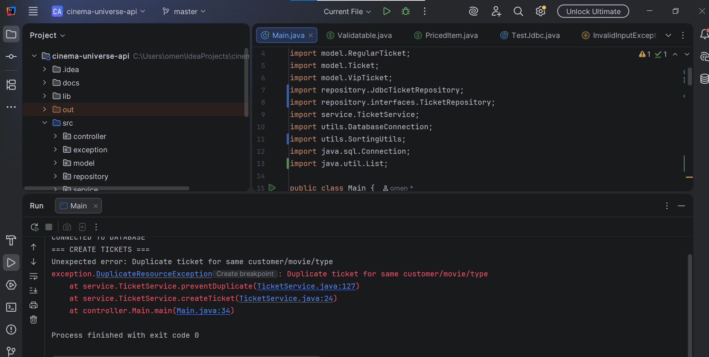
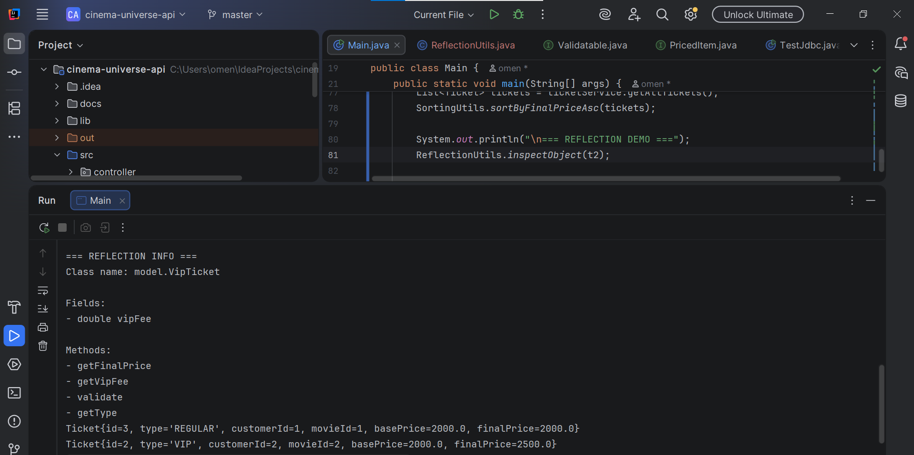

# Cinema Universe API
*Assignment 4 – SOLID Architecture & Advanced OOP Features (Refactoring Project)*  
Project Milestone 2 (builds on Assignment 3)

---

## Project Overview
Cinema Universe API is a console-based Java application that simulates a cinema ticket management system.
This project is a refactored version of Assignment 3 and demonstrates a SOLID-compliant multi-layer
architecture with advanced Object-Oriented Programming features.

The project focuses on clean architecture, maintainability, and extensibility while preserving
JDBC-based database interaction.

---

## Learning Goals
- Apply SOLID principles in a real Java project
- Refactor an existing project into a clean layered architecture
- Use advanced Java features (Generics, Lambdas, Reflection)
- Improve documentation and project structure

---

## SOLID Principles Documentation

### SRP – Single Responsibility Principle
Each class has a single responsibility:
- Main – application demonstration and CLI output only
- TicketService – business logic, validation, and exception handling
- JdbcTicketRepository – database access using JDBC
- SortingUtils – sorting logic only
- ReflectionUtils – runtime inspection only
- exception package – custom exception hierarchy

### OCP – Open/Closed Principle
The system is open for extension but closed for modification:
- Ticket is an abstract base class
- New ticket types can be added without modifying existing service or repository logic

### LSP – Liskov Substitution Principle
- RegularTicket and VipTicket correctly extend Ticket
- Subclasses behave correctly when used via Ticket references
- Polymorphism works without breaking system behavior

### ISP – Interface Segregation Principle
Small, focused interfaces:
- Validatable<T> – validation behavior
- PricedItem – pricing behavior  
Interfaces do not force unnecessary method implementations.

### DIP – Dependency Inversion Principle
- TicketService depends on TicketRepository interface
- Repository implementation is injected via constructor
- High-level modules do not depend on low-level implementations

---

## OOP Design

### Abstract Base Class
*Ticket (abstract class)*

Fields:
- id
- customer
- movieId
- basePrice

Abstract methods:
- getType()
- getFinalPrice()

Concrete method:
- shortInfo() – returns formatted ticket description

Encapsulation:
- All fields are private
- Access controlled via getters/setters

### Subclasses
- RegularTicket – final price equals base price
- VipTicket – final price equals base price + VIP fee

### Polymorphism
Tickets are handled through the base Ticket type.
At runtime, Java invokes the correct implementation of getFinalPrice().

### Composition / Aggregation
- Ticket contains a Customer
- Represented in OOP and database via foreign key relationship

---

## Interfaces & Advanced Features

### Interfaces
- Validatable<T> – enforces validation rules
- PricedItem – defines price-related behavior

Interface features:
- Abstract methods
- Default methods
- Static helper methods

---

## Generics
Generics are used in repository abstraction:
- Generic CRUD interface (CrudRepository<T, ID>)
- Enables reusable and type-safe data access layer

---

## Lambdas
Lambda expressions are used for:
- Sorting tickets by final price
- Comparator-based logic in utilities

Example usage:
- Sorting tickets by final price in ascending order

---

## Reflection / RTTI
A reflection utility demonstrates runtime inspection:
- Prints class name
- Lists fields
- Lists methods

Demonstrated in Main using ReflectionUtils.inspectObject(...).

---

## Database Design (PostgreSQL)

### Tables
- customers
- movies
- tickets

### Relationships
- tickets.customer_id → customers.customer_id
- tickets.movie_id → movies.movie_id

### Tickets Table Schema
sql
CREATE TABLE tickets (
  ticket_id SERIAL PRIMARY KEY,
  customer_id INT REFERENCES customers(customer_id),
  movie_id INT REFERENCES movies(movie_id),
  type VARCHAR(20),
  base_price NUMERIC(8,2),
  final_price NUMERIC(8,2)
);

---

## Sample Inserts
sql
INSERT INTO customers (name)
VALUES ('Anna'), ('Karima');

INSERT INTO movies (title, duration)
VALUES ('Inception', 148), ('Interstellar', 169);

INSERT INTO tickets (customer_id, movie_id, type, base_price, final_price)
VALUES
(1, 1, 'REGULAR', 2000, 2000),
(2, 2, 'VIP', 2000, 2500);

---

## Layered Architecture Explanation

### Controller Layer
- Responsible for interaction and demonstration only
- No business logic
- Delegates all operations to the service layer

### Service Layer
- Input validation
- Business rules (duplicate prevention, checks)
- Throws custom exceptions
- Depends on repository interfaces (DIP)

### Repository Layer
- JDBC-based data access
- Implements CRUD operations
- Uses PreparedStatement only
- Contains no business logic

### Utilities
- Sorting utilities (lambdas)
- Reflection utilities (RTTI)
- Validation helpers (optional)

---

## Exception Handling
Custom exception hierarchy:
- InvalidInputException
- DuplicateResourceException extends InvalidInputException
- ResourceNotFoundException
- DatabaseOperationException

All exceptions are thrown and handled in the service layer.

---

## Application Demonstration (Main)
The application demonstrates:
- Creating multiple tickets
- Retrieving all tickets
- Retrieving ticket by ID
- Deleting tickets
- Triggering validation and not-found exceptions
- Sorting tickets using lambdas
- Reflection output
- Polymorphism in action

---

## Project Structure

cinema-universe-api/
├── src/
│   ├── controller/
│   ├── service/
│   │   ├── interfaces/
│   ├── repository/
│   │   ├── interfaces/
│   ├── model/
│   ├── exception/
│   ├── utils/
│   │   ├── ReflectionUtils.java
│   │   ├── SortingUtils.java
│   ├── DatabaseConnection.java
│   └── Main.java
├── docs/
│   ├── screenshots/
│   └── uml.png
├── README.md
└── .gitignore

---

## How to Run
1. Ensure PostgreSQL is running
2. Create database tables using provided SQL
3. Update database credentials in DatabaseConnection
4. Run Main.java

---

## Screenshots

### CRUD Operations & Sorting (Lambda)

### Exception Handling (Service Layer)

### Reflection / RTTI

---

## UML Diagram
.png)
Includes:
- Abstract class and subclasses
- Interfaces
- Service and repository layers
- Relationships between entities

---

## Reflection
This project helped me understand:
- Practical application of SOLID principles
- Importance of service-layer validation
- Clean separation of responsibilities
- Usage of generics, lambdas, and reflection
- Benefits of layered architecture in real projects

---

## Conclusion
Cinema Universe API (Assignment 4) is a fully refactored SOLID-based Java application that combines:
- Advanced OOP design
- JDBC database integration
- Clean architecture
- Strong exception handling
- Professional documentation

This project demonstrates a complete and maintainable Java API design.
