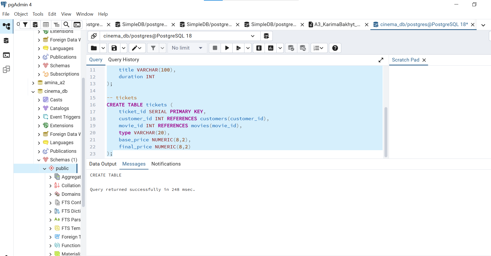
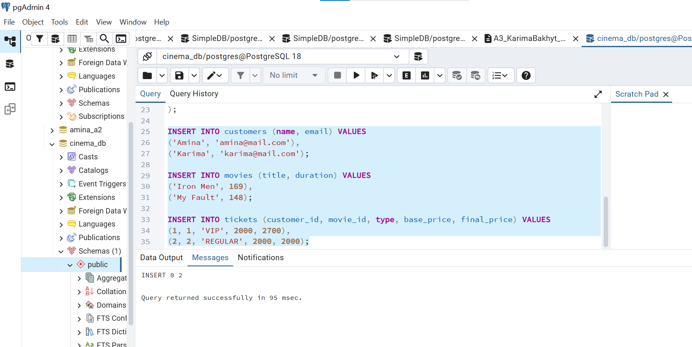
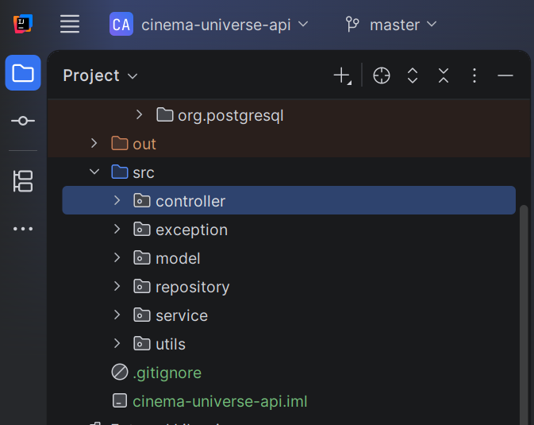
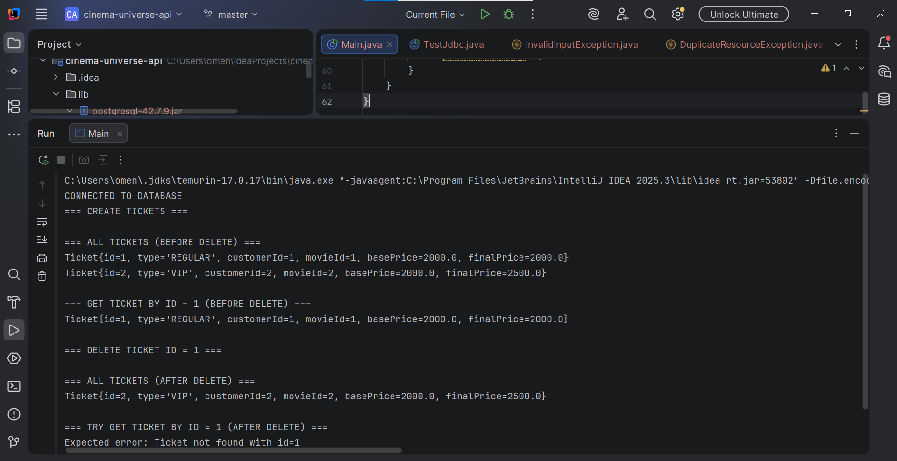

#  Cinema Universe API  
*Assignment 3 – Advanced OOP API Project (JDBC + Exception Handling)*

---

##  Project Overview

Cinema Universe API is a console-based Java application that simulates a cinema ticket management system.  
The project demonstrates advanced Object-Oriented Programming (OOP) principles, JDBC database interaction, and a clean multi-layer architecture.

The application allows:
- Creating different types of tickets
- Storing and retrieving data from a PostgreSQL database
- Applying business rules and validation
- Handling errors using a custom exception hierarchy

---

##  OOP Design

###  Abstract Base Class

*Ticket (abstract class)*

Fields:
- id
- customer
- movieId
- basePrice

Abstract methods:
- getType()
- getFinalPrice()

Concrete method:
- shortInfo() – returns a formatted string describing the ticket

---

###  Inheritance

Two subclasses extend the Ticket abstract class:
- RegularTicket – standard ticket with base price
- VipTicket – ticket with additional VIP fee

Each subclass overrides abstract methods and provides its own pricing logic.

---

###  Polymorphism

Tickets are handled using the base Ticket reference.  
At runtime, Java calls the correct implementation of getFinalPrice() depending on the ticket type.

---

###  Composition / Aggregation

Each Ticket object contains a Customer object.

Example:
Ticket → Customer

This demonstrates composition in the domain model.

---

##  Interfaces

The project follows interface-based design principles by separating responsibilities between layers and enforcing method contracts in service and model logic.

---

##  Database Design (PostgreSQL)

### Tables:
- customers
- movies
- tickets

### Relationships:
- tickets.customer_id → customers.customer_id
- tickets.movie_id → movies.movie_id

### Tickets Table Schema

sql
CREATE TABLE tickets (
    ticket_id SERIAL PRIMARY KEY,
    customer_id INT REFERENCES customers(customer_id),
    movie_id INT REFERENCES movies(movie_id),
    type VARCHAR(20),
    base_price NUMERIC(8,2),
    final_price NUMERIC(8,2)
);

---

##  JDBC & Repository Layer

- Uses DriverManager for database connection
- Uses PreparedStatement only (no Statement)
- Implements CRUD operations for tickets
- Handles SQL exceptions properly

---

##  Service Layer (Business Logic)

The service layer is responsible for:
- Input validation
- Preventing duplicate tickets
- Checking foreign key existence
- Applying business rules before database access

---

##  Exception Handling

Custom exception hierarchy:
- InvalidInputException
- DuplicateResourceException
- ResourceNotFoundException
- DatabaseOperationException

These exceptions provide meaningful error messages and clean error flow.

---

##  Controller / Main Demonstration

The Main class demonstrates:
- Creating multiple tickets
- Retrieving all tickets
- Retrieving ticket by ID
- Deleting tickets
- Handling errors (ticket not found)
- Polymorphism in action

All results are printed in the console.

---

##  Project Structure

cinema-universe-api/
├── src/
│   ├── controller/
│   ├── service/
│   ├── repository/
│   ├── model/
│   ├── exception/
│   ├── utils/
│   └── Main.java
├── .gitignore
├── cinema-universe-api.iml
└── README.md

---

##  How to Run

1. Ensure PostgreSQL is running
2. Update database credentials in DatabaseConnection
3. Run Main.java

---

## Screenshots

### 1. Database schema creation
This screenshot shows the creation of the relational database schema with primary and foreign keys.

### 2. Sample SQL INSERT statements
This screenshot demonstrates inserting initial data into the database tables.

### 3. Project structure (multi-layer architecture)
This screenshot shows the project structure with controller, service, repository, model, exception, and utils layers.

### 4. Application output and CRUD operations
This screenshot shows the console output demonstrating CRUD operations, polymorphism, and exception handling.

## UML Diagram

.png)
---

##  Reflection

This project helped me understand:
- Practical usage of abstract classes and inheritance
- Importance of service-layer validation
- JDBC interaction with relational databases
- Benefits of multi-layer architecture
- Proper exception handling strategies

---

##  Conclusion

Cinema Universe API is a complete example of a Java application that combines OOP principles, JDBC, database integration, validation logic, and structured exception handling.
